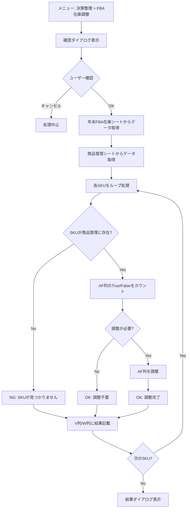

# FBA在庫調整

年末FBA在庫シートの在庫数と商品管理シートのAF列（売却廃却フラグ）を同期させる機能。

## 対応ファイル

| ファイル名 | 役割 |
|-----------|------|
| adjustingEntries_FbaInventory.js | FBA在庫調整のメイン処理 |

---

## 概要

決算整理において、年末時点のFBA在庫数と商品管理シートの在庫状態を一致させるための機能。
年末FBA在庫シートのS列（終了時の倉庫の在庫）を基準に、商品管理シートのAF列（売却廃却フラグ）を調整する。

---

## 処理フロー

---

## シート情報

### 年末FBA在庫シート

| 列 | 用途 |
|----|------|
| D列 | 出品者SKU |
| S列 | 終了時の倉庫の在庫数 |
| V列 | 処理結果（OK/NG） |
| W列 | エラー理由 |

- データ開始行: 2行目（1行目はヘッダー）
- 処理済みの行（V列がOK）はスキップ
- 処理完了時に行全体をグレーアウト

### 商品管理シート

| 列 | 用途 |
|----|------|
| Y列 | 実SKU（検索キー） |
| AF列 | 売却廃却フラグ（チェックボックス） |

- データ開始行: 3行目（1-2行目はヘッダー）
- AF列がTrue: 売却/廃却済み（在庫なし）
- AF列がFalse: 在庫あり

---

## 調整ロジック

**目標**: S列の在庫数 = AF列のFalse数

### ケース1: Falseが多い場合（在庫過剰）

S列の在庫数よりFalseの数が多い場合、上から順にAF列をTrueに変更する。

| 状況 | 操作 |
|------|------|
| S列の在庫: 2 | |
| 現在のAF列: False, False, False, True | False=3, True=1 |
| 調整後: True, False, False, True | False=2（在庫数と一致） |

### ケース2: Falseが少ない場合（在庫不足）

S列の在庫数よりFalseの数が少ない場合、下から順にAF列をFalseに変更する。

| 状況 | 操作 |
|------|------|
| S列の在庫: 3 | |
| 現在のAF列: True, True, False, True | False=1, True=3 |
| 調整後: True, False, False, False | False=3（在庫数と一致） |

### ケース3: 一致している場合

変更なし。V列に「OK」、W列に「調整不要」と記載。

---

## 処理結果の記載

### 成功時
- V列: OK
- W列: 空欄または「調整不要」
- 行全体をグレーアウト（背景色: #D3D3D3）

### エラー時
- V列: NG
- W列: エラー理由（例: 「商品管理シートにSKUが見つかりません」）
- 行はグレーアウトしない

---

## 関数一覧

| 関数名 | 説明 |
|--------|------|
| adjustingEntries_adjustFbaInventory | メイン関数（メニューから呼び出し） |
| adjustingEntries_getFbaInventoryData | 年末FBA在庫シートからデータ取得 |
| adjustingEntries_getProductData | 商品管理シートからデータ取得 |
| adjustingEntries_processAllSkus | 全SKUをループ処理 |
| adjustingEntries_processSingleSku | 単一SKUの処理 |
| adjustingEntries_findRowsBySku | Y列でSKU検索（全件取得） |
| adjustingEntries_countAfColumnStatus | AF列のTrue/Falseカウント |
| adjustingEntries_adjustAfColumn | AF列の調整処理 |
| adjustingEntries_markAsProcessed | V列/W列に結果記載＋グレーアウト |

---

## メニュー登録

スプレッドシートのメニューバーに「決算整理」メニューとして表示される。

- メニュー名: 決算整理
- アイテム名: FBA在庫調整
- 呼び出し関数: adjustingEntries_adjustFbaInventory
