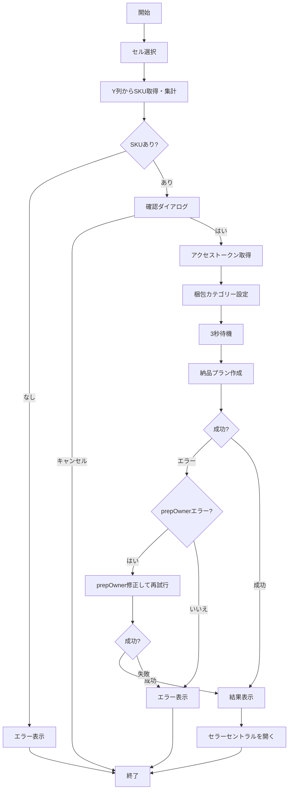

# FBA管理

FBA（Fulfillment by Amazon）納品プラン作成およびラベル生成機能。

## 対応ファイル

| ファイル名 | 役割 |
|-----------|------|
| Fbashipment.js | FBA納品プラン作成 |

---

## FBA納品プラン作成

### 概要

スプレッドシートの選択行からSKUを取得し、SP-API Fulfillment Inbound APIを使用してFBA納品プランを作成する。

### 処理フロー

### メイン関数

**関数**: createShipmentPlan

**処理内容**:
1. 選択範囲からY列のSKUを取得・集計
2. SKU確認ダイアログを表示
3. ユーザー承認後、SP-APIを呼び出し
4. 結果を表示し、セラーセントラルを開く

### SKU取得

**関数**: getSelectedSkus_

**処理内容**:
- getActiveRangeList()で飛び飛び選択（Ctrl+クリック）にも対応
- isRowHiddenByFilter()でフィルター非表示行を除外
- 選択された行のY列（25列目）からSKUを取得
- 同じSKUは個数をカウント
- 空のセルはスキップ

### 梱包カテゴリー設定

**関数**: setPrepDetails_

**API**: POST /inbound/fba/2024-03-20/items/prepDetails

**処理内容**:
- 全SKUの梱包カテゴリーをNONEに設定
- prepTypes: ITEM_NO_PREPを指定

**理由**: 一部のSKUではprepOwnerの指定が不要なため、事前にNONEを設定しておくことでエラーを回避

### 納品プラン作成

**関数**: createFbaInboundPlan_

**API**: POST /inbound/fba/2024-03-20/inboundPlans

**リクエストボディの主要項目**:
- destinationMarketplaces: マーケットプレイスID
- items: SKU・数量・prepOwner・labelOwner・expiration
- sourceAddress: 出荷元住所
- name: 納品プラン名（日時を含む）

**items配列の構成**:

| 項目 | 値 | 説明 |
|-----|-----|------|
| msku | SKU文字列 | 出品者SKU |
| quantity | 数値 | 個数 |
| prepOwner | SELLER/NONE | 梱包責任者 |
| labelOwner | SELLER | ラベル貼付責任者 |
| expiration | yyyy-MM-dd | 消費期限（3ヶ月後） |

### prepOwnerエラーの自動リトライ

**関数**: handlePrepOwnerError_

**処理内容**:
- エラーメッセージから「prepOwner不要」のSKUを検出
- 該当SKUのprepOwnerをNONEに変更
- リクエストを再構築して再試行

### 出荷元住所

**関数**: getSourceAddress_

**スクリプトプロパティから取得する住所情報**:

| プロパティ名 | 必須 | 説明 |
|-------------|-----|------|
| SHIP_FROM_NAME | 必須 | 発送者名 |
| SHIP_FROM_ADDRESS_LINE1 | 必須 | 住所1 |
| SHIP_FROM_ADDRESS_LINE2 | 任意 | 住所2 |
| SHIP_FROM_CITY | 必須 | 市区町村 |
| SHIP_FROM_STATE | 任意 | 都道府県 |
| SHIP_FROM_POSTAL_CODE | 必須 | 郵便番号 |
| SHIP_FROM_COUNTRY_CODE | 任意 | 国コード（デフォルト: JP） |
| SHIP_FROM_PHONE | 必須 | 電話番号 |

### 結果表示

**関数**: showResult_

**処理内容**:
1. 納品プランIDを取得
2. セラーセントラルの納品プラン画面URLを生成
3. 結果ダイアログを表示
4. セラーセントラルを新しいタブで開く

**セラーセントラルURL形式**:
https://sellercentral.amazon.co.jp/fba/sendtoamazon/confirm_content_step?wf={inboundPlanId}

---

## 使用API一覧

| API | バージョン | エンドポイント | 用途 |
|-----|---------|--------------|------|
| Fulfillment Inbound API | 2024-03-20 | /inbound/fba/2024-03-20/inboundPlans | 納品プラン作成 |
| Fulfillment Inbound API | 2024-03-20 | /inbound/fba/2024-03-20/items/prepDetails | 梱包カテゴリー設定 |
| FBA Inventory API | v1 | /fba/inventory/v1/summaries | SKU詳細情報取得 |

---

## スクリプトプロパティ設定

FBA管理機能を使用するには、以下のスクリプトプロパティを設定する必要がある。

### 認証情報（共通）

| プロパティ名 | 必須 | 用途 |
|-------------|-----|------|
| LWA_CLIENT_ID | 必須 | LWAクライアントID |
| LWA_CLIENT_SECRET | 必須 | LWAクライアントシークレット |
| LWA_REFRESH_TOKEN | 必須 | LWAリフレッシュトークン |
| LWA_TOKEN_ENDPOINT | 必須 | LWAトークンエンドポイント |
| SELLER_ID | 必須 | セラーID |
| MARKETPLACE_ID | 必須 | マーケットプレイスID |
| SP_API_ENDPOINT | 必須 | SP-APIエンドポイント |

### 出荷元住所（納品プラン作成のみ）

| プロパティ名 | 必須 | 用途 |
|-------------|-----|------|
| SHIP_FROM_NAME | 必須 | 発送者名 |
| SHIP_FROM_ADDRESS_LINE1 | 必須 | 住所1 |
| SHIP_FROM_ADDRESS_LINE2 | 任意 | 住所2 |
| SHIP_FROM_CITY | 必須 | 市区町村 |
| SHIP_FROM_STATE | 任意 | 都道府県 |
| SHIP_FROM_POSTAL_CODE | 必須 | 郵便番号 |
| SHIP_FROM_COUNTRY_CODE | 任意 | 国コード（デフォルト: JP） |
| SHIP_FROM_PHONE | 必須 | 電話番号 |

---

## デバッグ機能

### Script Properties確認

**関数**: checkScriptProperties

**用途**: 設定されているスクリプトプロパティの状況を確認

### SP-API接続テスト

**関数**: testSpApiConnection

**用途**: アクセストークン取得のみを実行し、SP-APIへの接続を確認
