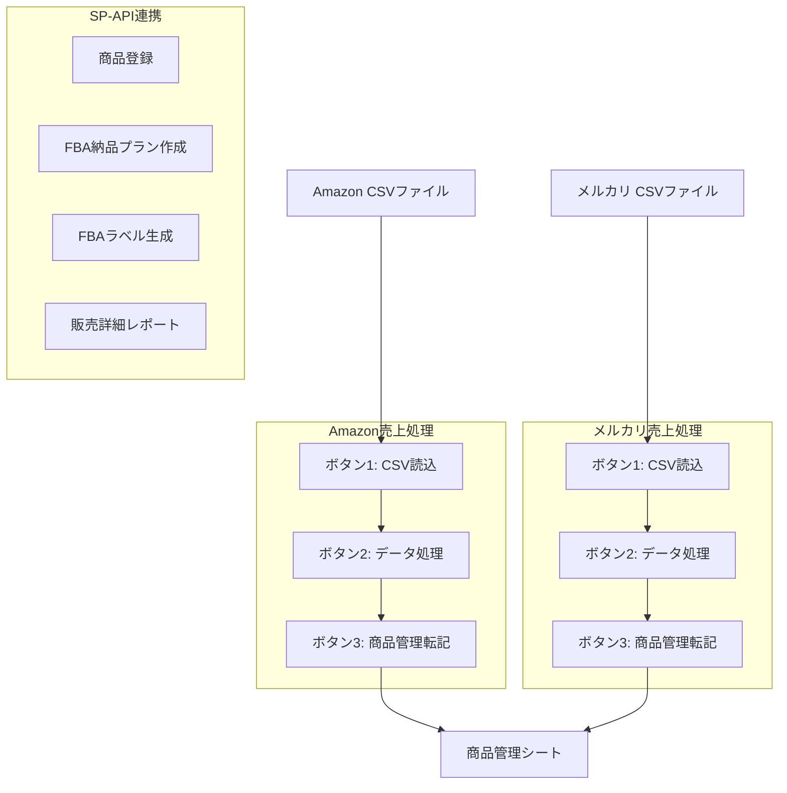

# システム概要

## 目的

Amazon・メルカリの売上データを手動転記する作業を自動化し、複数プラットフォームの統一的な商品管理を効率化するシステム。

## 技術スタック

| 項目 | 技術 |
|-----|------|
| プラットフォーム | Google Apps Script (GAS) |
| ランタイム | V8 |
| データストア | Google Sheets |
| 外部API | Amazon SP-API（Selling Partner API） |
| 認証方式 | LWA (Login with Amazon) |
| UI | HTML Service（モーダルダイアログ） |
| バージョン管理 | Git + clasp |
| タイムゾーン | Asia/Tokyo |

---

## 主要機能一覧

| 機能 | 概要 |
|------|------|
| Amazon売上処理 | CSV読込→データ処理→商品管理転記の3段階処理 |
| メルカリ売上処理 | CSV読込→データ処理→商品管理転記の3段階処理 |
| 商品登録 | SP-APIを使用したAmazon商品登録 |
| FBA納品プラン | SP-APIを使用した納品プラン作成 |
| FBAラベル生成 | 商品ラベルのHTML生成・印刷 |
| 販売詳細レポート | SP-API Finances APIを使用した売上レポート出力 |
| 商品管理コピー | 利益確認シートから商品管理シートへのデータ転記 |

---

## 処理フロー図

---

## ファイル構成

| ファイル名 | 行数 | 役割 |
|-----------|------|------|
| config.js | 30 | スプレッドシート列構成設定 |
| onOpen.js | 18 | メニュー初期化 |
| amazonUI.js | 194 | Amazon UI・ボタンハンドラー |
| amazonDataProcessing.js | 402 | Amazon データ処理・SKU検索 |
| amazonProductTransfer.js | 425 | Amazon 商品管理転記 |
| amazonSalesReport.js | 806 | SP-API販売詳細レポート出力 |
| mercariUI.js | 193 | メルカリ UI・ボタンハンドラー |
| mercariDataProcessing.js | 465 | メルカリ データ処理・SKU検索 |
| mercariProductTransfer.js | 144 | メルカリ 商品管理転記 |
| registerProducts.js | 998 | SP-API商品登録 |
| Fbashipment.js | 637 | FBA納品プラン作成 |
| FbaLabelGenerator.js | 336 | FBAラベル生成 |
| CopyToProductManagement.js | 310 | 利益確認シート→商品管理コピー |
| spapi_bulk_listing_register.js | 240 | SP-API一括登録補助 |
| amazonCsvDialog.html | - | Amazon CSV読込ダイアログ |
| mercariCsvDialog.html | - | メルカリ CSV読込ダイアログ |
| FbaLabelView.html | - | FBAラベル表示 |

---

## メニュー構成

スプレッドシートを開くと「カスタム」メニューが表示される。

| メニュー項目 | 実行関数 | 機能 |
|-------------|---------|------|
| 商品登録 | registerSelectedProducts | 選択行の商品をAmazonに登録 |
| 納品プラン作成 | createShipmentPlan | FBA納品プランを作成 |
| 商品ラベル生成 | generateFbaLabelsFromSelection | FBAラベルをHTML生成 |
| 販売詳細レポートを出力 | showMonthSelectionDialog | 月別販売レポートをCSV出力 |

---

## スプレッドシート構成

### シート一覧

| シート名 | 用途 |
|---------|------|
| Amazon売上 | Amazon売上CSVデータ格納 |
| メルカリ売上 | メルカリ売上CSVデータ格納 |
| 商品管理 | 統一商品管理（全プラットフォーム共通） |
| 利益確認 | 利益計算用シート |

### 列構成（商品管理シート）

| 列 | 項目 | 説明 |
|---|------|------|
| A | 商品ステータス | IFS関数による動的ステータス表示 |
| B | 仕入月 | 仕入れた月（**月形式） |
| E | 商品名 | 商品名称 |
| F | ASIN | Amazon商品識別子 |
| H | 価格 | 販売価格 |
| X | SKU | 出品者SKU |
| Y | 実SKU | 実際に使用するSKU（重複判定用） |
| Z | 商品受領フラグ | FALSE=未受領、TRUE=受領済 |
| AA | 販売中フラグ | TRUE=販売中 |
| AB | 売上日 | 売上発生日 |
| AC | 販売価格 | 実売価格 |
| AD | 入金価格 | 実入金額 |
| AE | 配送サービス | 配送料金情報 |
| AF | 売却廃却フラグ | TRUE=売却/廃却済 |
| AG | その他金額 | 調整額など |

### 商品ステータス値

A列のステータスはIFS関数により以下の4段階で自動計算される。

| ステータス | 条件 |
|----------|------|
| 1.商品未受領 | Z列=FALSE |
| 2.受領/検品済 | Z列=TRUE |
| 3.販売中 | AA列=TRUE |
| 4.販売/処分済 | AF列=TRUE |

---

## 認証情報管理

SP-API認証情報はPropertiesServiceのスクリプトプロパティで管理する。

| プロパティ名 | 用途 |
|-------------|------|
| LWA_CLIENT_ID | LWAクライアントID |
| LWA_CLIENT_SECRET | LWAクライアントシークレット |
| LWA_REFRESH_TOKEN | LWAリフレッシュトークン |
| LWA_TOKEN_ENDPOINT | LWAトークンエンドポイント |
| SELLER_ID | セラーID |
| MARKETPLACE_ID | マーケットプレイスID |
| SP_API_ENDPOINT | SP-APIエンドポイント |
| SHIP_FROM_NAME | 出荷元名称 |
| SHIP_FROM_ADDRESS_LINE1 | 出荷元住所1 |
| SHIP_FROM_ADDRESS_LINE2 | 出荷元住所2 |
| SHIP_FROM_CITY | 出荷元市区町村 |
| SHIP_FROM_STATE | 出荷元都道府県 |
| SHIP_FROM_POSTAL_CODE | 出荷元郵便番号 |
| SHIP_FROM_COUNTRY_CODE | 出荷元国コード |
