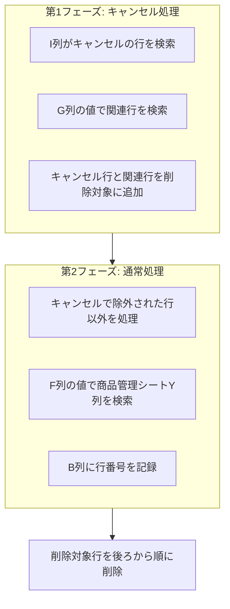

# 売上データ処理

Amazon・メルカリの売上CSVデータを読み込み、商品管理シートに転記する機能。

## 対応ファイル

| ファイル名 | 役割 |
|-----------|------|
| amazonUI.js | Amazon UI・ボタンハンドラー |
| amazonDataProcessing.js | Amazon データ処理・SKU検索 |
| amazonProductTransfer.js | Amazon 商品管理転記 |
| amazonCsvDialog.html | Amazon CSV読込ダイアログ |
| mercariUI.js | メルカリ UI・ボタンハンドラー |
| mercariDataProcessing.js | メルカリ データ処理・SKU検索 |
| mercariProductTransfer.js | メルカリ 商品管理転記 |
| mercariCsvDialog.html | メルカリ CSV読込ダイアログ |

---

## 共通処理フロー

Amazon・メルカリ共に3段階の処理フローで構成される。

| 段階 | 処理内容 |
|-----|---------|
| ボタン1 | CSVファイルをダイアログで読み込み、売上シートに書き込み |
| ボタン2 | 転記先の行番号を検索し、A列・B列に処理結果を記録 |
| ボタン3 | B列の行番号を参照し、商品管理シートに売上情報を転記 |

---

## Amazon売上処理

### ボタン1: CSV読込

**関数**: handleAmazonCsvImport → processAmazonCsvContent

**処理内容**:
1. HTMLダイアログを表示
2. ユーザーがCSVファイルを選択
3. CSVの9行目以降をデータとして解析
4. Amazon売上シートのF列以降に書き込み
5. 重複チェックを実行（既存データとの完全一致を検出）

**CSV読み込み仕様**:
- 読み込み開始位置: 9行目（8行目まではヘッダー）
- 書き込み開始列: F列（6列目）
- 重複判定: 全列の値が完全一致する場合は追加しない

---

### ボタン2: データ処理

**関数**: handleAmazonDataProcessing → processAmazonData

**処理条件**:
- 3行目以降が処理対象
- A列が空白の行のみ処理

**トランザクション種類別処理（H列の値に基づく）**:

| トランザクション種類 | 処理内容 | A列の値 | B列の値 |
|-------------------|---------|--------|--------|
| FBA在庫関連の手数料 | 転記対象外に設定 | 転記対象外 | - |
| 振込み | 転記対象外に設定 | 転記対象外 | - |
| 注文外料金 | 転記対象外に設定 | 転記対象外 | - |
| 配送サービス | 注文番号検索 | - | 参照式 |
| 調整 | 商品名で分岐処理 | - | 行番号 |
| 返金 | 注文番号検索 | - | 参照式 |
| 注文 | SKU検索 | - | 行番号 |

**注文処理の詳細**:
- J列のSKUで商品管理シートのY列を検索
- L列の数量分だけ繰り返し検索
- 見つかった行番号をカンマ区切りでB列に記録
- C列に商品管理シートへのハイパーリンクを設定

**返金・配送サービス処理の詳細**:
- I列の注文番号でAmazon売上シート内を検索
- 見つかった行のB列・C列を参照する数式を設定

**調整処理の詳細**:
- 商品名に「FBA在庫の返金 - 購入者による返品:」が含まれる場合は転記対象外
- それ以外はSKU検索を実行

**検索対象の商品ステータス**:
- 「4.販売/処分済」以外のステータスのみ検索対象
- 使用済み行は次回検索から除外（同一SKUの複数商品に対応）

---

### ボタン3: 商品管理転記

**関数**: handleAmazonTransfer → transferAmazonToProductSheet

**処理条件**:
- A列が空白の行のみ処理
- B列に転記先行番号が設定されている行

**トランザクション種類別転記処理**:

| 種類 | 転記先列 | 転記内容 |
|-----|---------|---------|
| 注文 | AB列 | F列の日付 |
| | AC列 | S列＋T列の合計（複数行の場合は分割） |
| | AD列 | AG列の値（複数行の場合は分割） |
| | AF列 | TRUE |
| 返金 | AB列〜AD列 | クリア |
| | AF列 | FALSE |
| 配送サービス | AE列 | AG列の値（マイナス記号除去） |
| 調整 | AB列 | F列の日付 |
| | AD列 | AG列の値 |
| | AF列 | TRUE |

**複数行転記**:
- B列がカンマ区切りの場合、複数行に分割転記
- 金額は行数で均等分割

**転記完了後の処理**:
- A列に「転記済み」または「返金処理済み」を記録
- E列に処理日を記録

---

## メルカリ売上処理

### ボタン1: CSV読込

**関数**: handleMercariCsvImport → processMercariCsvContent

**処理内容**:
1. HTMLダイアログを表示
2. ユーザーがCSVファイルを選択
3. CSVの2行目以降をデータとして解析（1行目はヘッダー）
4. メルカリ売上シートのG列以降に書き込み
5. 重複チェックを実行

**CSV読み込み仕様**:
- 読み込み開始位置: 2行目（1行目はヘッダー）
- 書き込み開始列: G列（7列目）
- 重複判定: 全列の値が完全一致する場合は追加しない

---

### ボタン2: データ処理

**関数**: handleMercariDataProcessing → processMercariData

**2フェーズ処理**:

**第1フェーズ: キャンセル処理**:
- I列に「キャンセル」が含まれる行を検出
- G列の値で同じ値を持つ他の行を検索
- キャンセル行と関連行を削除対象リストに追加
- 処理完了後に後ろから順番に行削除

**第2フェーズ: 通常処理**:
- キャンセルで除外された行以外を処理
- F列が空白の場合は「転記対象外」
- F列の値で商品管理シートのY列を検索
- O列の数量（「○個」「○つ」形式）分だけ繰り返し検索
- 見つかった行番号をカンマ区切りでB列に記録

---

### ボタン3: 商品管理転記

**関数**: handleMercariTransfer → transferMercariToProductSheet

**処理条件**:
- A列が空白の行のみ処理
- B列に転記先行番号が設定されている行

**転記内容**:

| 転記先列 | 転記元 |
|---------|-------|
| AB列（売上日） | M列 |
| AC列（販売価格） | S列（複数行の場合は分割） |
| AD列（入金価格） | R列（複数行の場合は分割） |
| AF列（売却廃却） | TRUE |

**転記完了後の処理**:
- A列に「転記済み」を記録
- E列に処理日を記録

---

## 売上シート列構成

### Amazon売上シート

| 列 | 項目 | 用途 |
|---|------|------|
| A | ステータス | 処理結果（転記済み、転記対象外など） |
| B | 転記先行番号 | 商品管理シートの行番号（カンマ区切りで複数可） |
| C | リンク | 商品管理シートへのハイパーリンク |
| D | 処理日 | データ処理実行日 |
| E | 転記日 | 商品管理転記実行日 |
| F〜 | CSVデータ | 読み込んだCSVデータ |

**CSVデータ主要列**:
| 列 | 項目 |
|---|------|
| F | 日付/時間 |
| H | トランザクション種類 |
| I | 注文番号 |
| J | SKU |
| K | 商品名 |
| L | 数量 |
| S | 商品売上 |
| T | 商品の売上税 |
| AG | 合計（振込金額） |

### メルカリ売上シート

| 列 | 項目 | 用途 |
|---|------|------|
| A | ステータス | 処理結果（転記済み、転記対象外など） |
| B | 転記先行番号 | 商品管理シートの行番号（カンマ区切りで複数可） |
| C | リンク | 商品管理シートへのハイパーリンク |
| D | 処理日 | データ処理実行日 |
| E | 転記日 | 商品管理転記実行日 |
| G〜 | CSVデータ | 読み込んだCSVデータ |

**CSVデータ主要列**:
| 列 | 項目 |
|---|------|
| F | カスタムID（Y列検索用） |
| G | 取引ID |
| I | 取引ステータス |
| M | 売上日 |
| O | 数量 |
| R | 入金額 |
| S | 販売価格 |

---

## エラーハンドリング

| 状況 | 処理 |
|-----|------|
| シートが見つからない | エラーメッセージを表示して処理中断 |
| SKU検索で該当なし | その行をスキップ（A列・B列への記録なし） |
| 注文番号検索で該当なし | その行をスキップ |
| CSV形式エラー | エラーメッセージを表示して処理中断 |
| 重複データ | 追加せずにメッセージ表示 |
