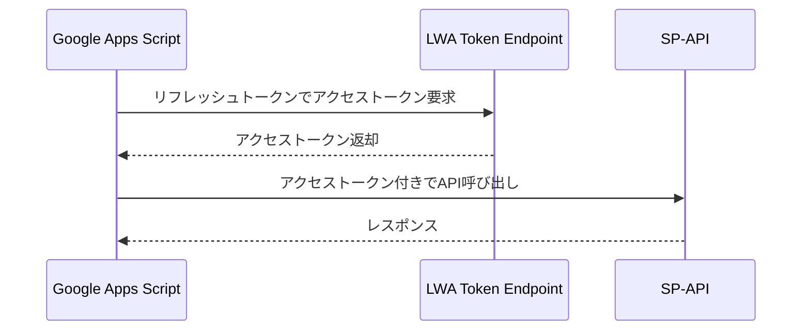
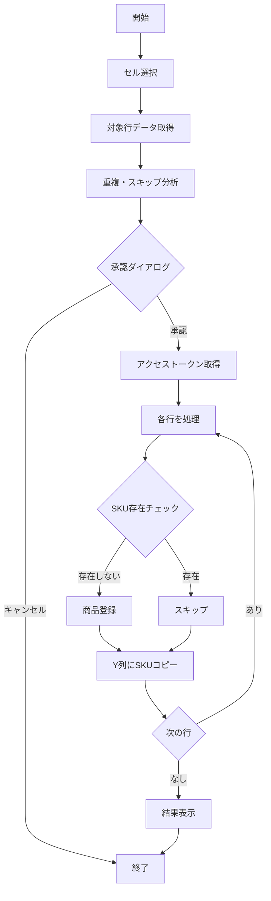
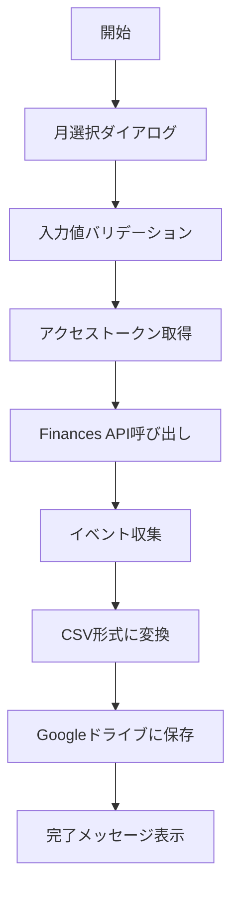

# SP-API連携

Amazon Selling Partner API (SP-API) を使用した商品登録・販売詳細レポート機能。

## 対応ファイル

| ファイル名 | 役割 |
|-----------|------|
| registerProducts.js | SP-API商品登録 |
| spapi_bulk_listing_register.js | SP-API一括登録補助 |
| amazonSalesReport.js | SP-API販売詳細レポート出力 |

---

## 認証

### LWA (Login with Amazon) 認証フロー

### 認証情報の管理

スクリプトプロパティで以下の値を管理する。

| プロパティ名 | 用途 |
|-------------|------|
| LWA_CLIENT_ID | LWAクライアントID |
| LWA_CLIENT_SECRET | LWAクライアントシークレット |
| LWA_REFRESH_TOKEN | LWAリフレッシュトークン |
| LWA_TOKEN_ENDPOINT | LWAトークンエンドポイント |
| SELLER_ID | セラーID |
| MARKETPLACE_ID | マーケットプレイスID |
| SP_API_ENDPOINT | SP-APIエンドポイント |

### アクセストークン取得処理

**関数**: getAccessToken

**処理内容**:
1. スクリプトプロパティから認証情報を取得
2. LWAトークンエンドポイントにPOSTリクエスト
3. リフレッシュトークンを使用してアクセストークンを取得
4. 取得したアクセストークンを返却

**リクエストパラメータ**:
- grant_type: refresh_token
- refresh_token: LWAリフレッシュトークン
- client_id: LWAクライアントID
- client_secret: LWAクライアントシークレット

---

## 商品登録機能

### 概要

スプレッドシートの選択行からASIN・SKU・価格を取得し、SP-API Listings APIを使用してAmazonに商品を登録する。

### 処理フロー

### メイン関数

**関数**: registerSelectedProducts

**処理内容**:
1. 選択範囲から対象行を取得
2. 重複チェック・スキップ対象の分析
3. 承認ダイアログを表示
4. 承認後、アクセストークンを取得
5. 各行に対して登録処理を実行
6. 結果ダイアログを表示

### 重複・スキップ判定

**判定基準**:

| 条件 | 処理 |
|-----|------|
| Y列に値がある | スキップ（登録済み） |
| X列の値が他の行と重複 | 最初の1行のみ処理、他はスキップ |
| ASIN未設定 | バリデーションエラー |
| SKU未設定 | バリデーションエラー |
| 価格が無効 | バリデーションエラー |

### SKU存在チェック

**関数**: checkSkuExists

**API**: GET /listings/2021-08-01/items/{sellerId}/{sku}

**処理内容**:
- 指定SKUがAmazonに登録済みかをチェック
- HTTP 200が返れば登録済み、404なら未登録

### 商品登録

**関数**: putListing

**API**: PUT /listings/2021-08-01/items/{sellerId}/{sku}

**処理フロー**:
1. Catalog APIで商品タイプを取得
2. Listings APIで商品を登録

**リクエストボディの主要項目**:
- productType: 商品タイプ（Catalog APIから取得）
- requirements: LISTING_OFFER_ONLY
- condition_type: new_new
- purchasable_offer: 価格情報
- fulfillment_availability: AMAZON_JP（FBA）
- merchant_suggested_asin: ASIN

### 商品タイプ取得

**関数**: getProductTypeByAsin

**API**: GET /catalog/2022-04-01/items/{asin}

**処理内容**:
- ASINから商品タイプを取得
- productTypesまたはsummariesから取得を試みる

### 登録完了後の処理

**成功時**:
- Y列にX列の値をコピー（登録済みマーク）
- 重複スキップした行のY列にもコピー

**エラー時**:
- 結果セルにエラーメッセージを表示
- 背景色を赤に設定

---

## 販売詳細レポート機能

### 概要

Finances APIからトランザクションデータを取得し、CSVファイルとしてGoogleドライブに保存する。

### 処理フロー

### メイン関数

**関数**: showMonthSelectionDialog → generateReport

**処理内容**:
1. 月選択ダイアログを表示（YYYYMM形式で入力）
2. 対象月の開始日・終了日を計算
3. アクセストークンを取得
4. Finances APIからデータを取得
5. CSVデータに変換
6. Googleドライブに保存

### Finances API呼び出し

**関数**: fetchFinancialEvents

**API**: GET /finances/v0/financialEvents

**パラメータ**:
- PostedAfter: 開始日
- PostedBefore: 終了日
- NextToken: ページネーション用（2ページ目以降）

**レート制限対応**:
- HTTP 429の場合は5秒待機して再試行
- 各ページ取得後に2秒待機

### イベント収集

**収集対象**:

| イベント種類 | 関数 | 説明 |
|-------------|------|------|
| ShipmentEventList | collectShipmentEvents | 出荷イベント |
| RefundEventList | collectRefundEvents | 返金イベント |
| ServiceFeeEventList | collectServiceFeeEvents | サービス料金イベント |
| AdjustmentEventList | collectAdjustmentEvents | 調整イベント |

### CSVヘッダー定義

| # | 項目名 |
|---|-------|
| 1 | 日付/時間 |
| 2 | 決済番号 |
| 3 | トランザクションの種類 |
| 4 | 注文番号 |
| 5 | SKU |
| 6 | 商品名 |
| 7 | 数量 |
| 8 | Amazon 出品サービス |
| 9 | フルフィルメント |
| 10 | 市町村 |
| 11 | 都道府県 |
| 12 | 郵便番号 |
| 13 | 税金徴収型 |
| 14 | 商品売上 |
| 15 | 商品の売上税 |
| 16 | 配送料 |
| 17 | 配送料の税金 |
| 18 | ギフト包装手数料 |
| 19 | ギフト包装クレジットの税金 |
| 20 | Amazonポイントの費用 |
| 21 | プロモーション割引額 |
| 22 | プロモーション割引の税金 |
| 23 | 源泉徴収税を伴うマーケットプレイス |
| 24 | 手数料 |
| 25 | FBA 手数料 |
| 26 | トランザクションに関するその他の手数料 |
| 27 | その他 |
| 28 | 合計 |

### CSV出力

**関数**: saveToGoogleDrive

**出力先**: DRIVE_FOLDER_IDで指定したGoogleドライブフォルダ

**ファイル名**: 販売詳細レポート_{YYYYMM}.csv

**文字コード**: BOM付きUTF-8

**重複対策**: 同名ファイルが存在する場合は連番を付与

---

## 使用API一覧

| API | バージョン | エンドポイント | 用途 |
|-----|---------|--------------|------|
| Listings API | 2021-08-01 | /listings/2021-08-01/items/ | SKU存在チェック・商品登録 |
| Catalog Items API | 2022-04-01 | /catalog/2022-04-01/items/ | 商品タイプ取得 |
| Finances API | v0 | /finances/v0/financialEvents | 販売詳細レポート取得 |

---

## エラーハンドリング

| エラー種類 | 対応 |
|-----------|------|
| 認証エラー (401/403) | エラーメッセージを表示して処理中断 |
| レート制限 (429) | 待機後に再試行 |
| SKU存在エラー | スキップして次の行を処理 |
| 商品タイプ取得失敗 | エラーとして記録 |
| 無効なASIN/SKU/価格 | バリデーションエラーとして記録 |

---

## スクリプトプロパティ設定

商品登録・販売詳細レポート機能を使用するには、以下のスクリプトプロパティを設定する必要がある。

| プロパティ名 | 必須 | 用途 |
|-------------|-----|------|
| LWA_CLIENT_ID | 必須 | LWAクライアントID |
| LWA_CLIENT_SECRET | 必須 | LWAクライアントシークレット |
| LWA_REFRESH_TOKEN | 必須 | LWAリフレッシュトークン |
| LWA_TOKEN_ENDPOINT | 必須 | LWAトークンエンドポイント |
| SELLER_ID | 必須 | セラーID |
| MARKETPLACE_ID | 必須 | マーケットプレイスID |
| SP_API_ENDPOINT | 必須 | SP-APIエンドポイント |
| DRIVE_FOLDER_ID | 販売詳細レポートのみ | 出力先GoogleドライブフォルダID |
