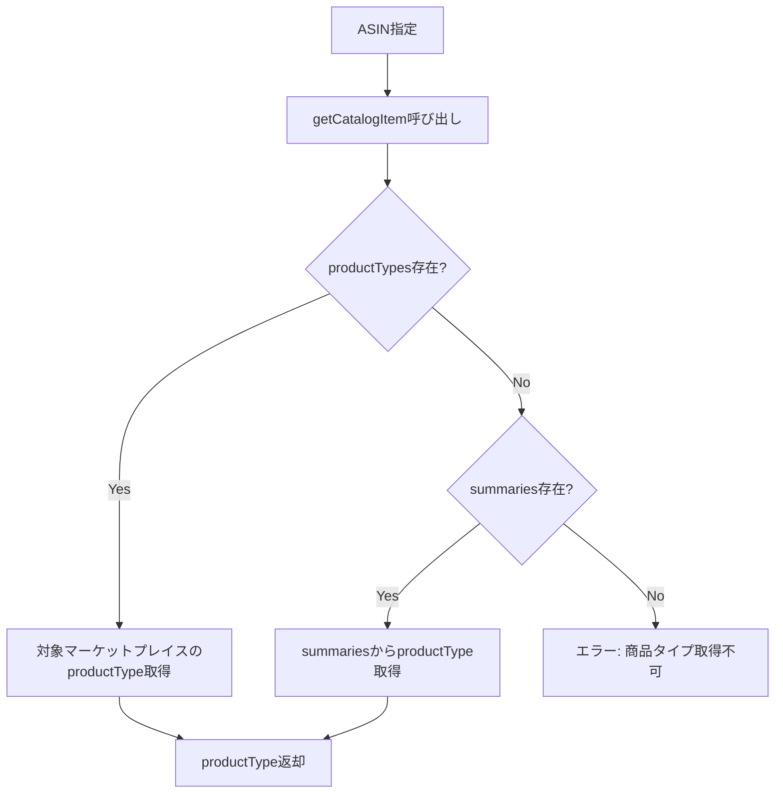

# Catalog Items API 仕様

本ドキュメントでは、商品タイプ取得に使用するCatalog Items API v2022-04-01の仕様を説明する。

---

## 概要

Catalog Items APIは、Amazonカタログ内の商品情報を取得するAPIである。ASINに基づいて商品詳細、画像、ランキング、商品タイプなどの情報を取得できる。

---

## エンドポイント

| リージョン | エンドポイント |
|-----------|---------------|
| 日本（極東） | https://sellingpartnerapi-fe.amazon.com |

---

## 主要オペレーション

| オペレーション | HTTPメソッド | 用途 |
|--------------|-------------|------|
| getCatalogItem | GET | 単一ASIN のカタログ情報取得 |
| searchCatalogItems | GET | キーワードによるカタログ検索 |

---

## getCatalogItem

### URL構造

/catalog/2022-04-01/items/{asin}?marketplaceIds={marketplaceId}&includedData={includedData}

### パスパラメータ

| パラメータ | 必須 | 説明 |
|-----------|------|------|
| asin | Yes | 取得対象のASIN |

### クエリパラメータ

| パラメータ | 必須 | 説明 |
|-----------|------|------|
| marketplaceIds | Yes | マーケットプレイスID |
| includedData | No | 取得するデータ種別（カンマ区切り） |

---

## includedData オプション

| 値 | 説明 |
|-----|------|
| attributes | 商品属性 |
| dimensions | 寸法情報 |
| identifiers | 識別子（ASIN、EAN、UPC等） |
| images | 商品画像 |
| productTypes | 商品タイプ |
| relationships | バリエーション関係 |
| salesRanks | 売上ランキング |
| summaries | 概要情報（タイトル、ブランド等） |
| vendorDetails | ベンダー詳細 |

---

## レスポンス構造

### 基本構造

| フィールド | 説明 |
|-----------|------|
| asin | 商品のASIN |
| attributes | 商品属性（JSON Schema準拠） |
| dimensions | 寸法情報 |
| identifiers | 識別子一覧 |
| images | 画像URL一覧 |
| productTypes | 商品タイプ一覧 |
| relationships | バリエーション情報 |
| salesRanks | ランキング情報 |
| summaries | 概要情報 |

### productTypes構造

| フィールド | 説明 |
|-----------|------|
| marketplaceId | マーケットプレイスID |
| productType | 商品タイプ名 |

### summaries構造

| フィールド | 説明 |
|-----------|------|
| marketplaceId | マーケットプレイスID |
| brandName | ブランド名 |
| itemName | 商品名 |
| manufacturer | メーカー |
| productType | 商品タイプ |

---

## 商品タイプの取得方法

Listings Items APIで商品登録する際、productTypeが必須となる。ASINから商品タイプを取得する手順は以下の通り。

1. getCatalogItemを呼び出す
2. includedDataにproductTypesまたはsummariesを指定
3. レスポンスからproductTypeを抽出

### 取得優先順位

1. productTypes配列から対象マーケットプレイスのproductTypeを取得
2. productTypesがない場合、summaries配列から取得
3. どちらも取得できない場合はエラー

---

## レート制限

| オペレーション | Rate | Burst |
|--------------|------|-------|
| getCatalogItem | 2 requests/second | 2 |
| searchCatalogItems | 2 requests/second | 2 |

---

## エラーレスポンス

| HTTPステータス | 説明 |
|--------------|------|
| 400 | リクエストパラメータ不正 |
| 403 | 権限不足 |
| 404 | ASINが見つからない |
| 429 | レート制限超過 |
| 500 | サーバーエラー |

---

## 本プロジェクトでの実装

### 関連ファイル

| ファイル | 関数 | 役割 |
|---------|------|------|
| spapi_registerProducts.js | spapi_getProductTypeByAsin | ASINから商品タイプを取得 |

### 処理フロー

---

## APIバージョンについて

| バージョン | ステータス | 備考 |
|-----------|-----------|------|
| v2022-04-01 | 現行 | 推奨バージョン |
| v2020-12-01 | 非推奨 | 移行推奨 |
| v0 | 廃止予定 | 2025年1月28日に廃止 |

---

## 公式リファレンス

- Catalog Items API: https://developer-docs.amazon.com/sp-api/docs/catalog-items-api
- Catalog Items API v2022-04-01 Reference: https://developer-docs.amazon.com/sp-api/docs/catalog-items-api-v2022-04-01-reference
- Product Type Definitions API: https://developer-docs.amazon.com/sp-api/docs/product-type-definitions-api
