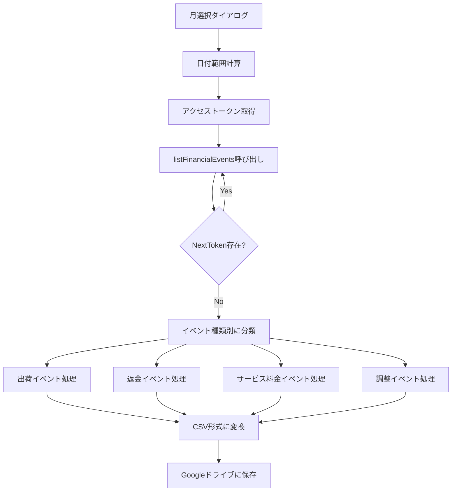

# Finances API 仕様

本ドキュメントでは、売上レポート取得に使用するFinances APIの仕様を説明する。

---

## 概要

Finances APIは、セラーの財務情報を取得するAPIである。注文、日付範囲、イベントグループに基づいて財務イベントを取得できる。決算期間を待たずにリアルタイムでデータにアクセス可能。

---

## APIバージョン

| バージョン | ステータス | 備考 |
|-----------|-----------|------|
| v2024-06-19 | 最新 | 新しい機能を含む |
| v0 | 現行 | 広く使用されているバージョン |

---

## エンドポイント

| リージョン | エンドポイント |
|-----------|---------------|
| 日本（極東） | https://sellingpartnerapi-fe.amazon.com |

---

## 主要オペレーション

| オペレーション | HTTPメソッド | 用途 |
|--------------|-------------|------|
| listFinancialEvents | GET | 財務イベント一覧取得 |
| listFinancialEventsByGroupId | GET | イベントグループ別の財務イベント取得 |
| listFinancialEventsByOrderId | GET | 注文別の財務イベント取得 |
| listFinancialEventGroups | GET | 財務イベントグループ一覧取得 |

---

## listFinancialEvents

### URL構造

/finances/v0/financialEvents

### クエリパラメータ

| パラメータ | 必須 | 説明 |
|-----------|------|------|
| PostedAfter | No | この日時以降のイベントを取得（ISO 8601形式） |
| PostedBefore | No | この日時以前のイベントを取得（ISO 8601形式） |
| MaxResultsPerPage | No | 1ページあたりの最大結果数（デフォルト100） |
| NextToken | No | ページネーション用トークン |

---

## 財務イベントの種類

### ShipmentEventList（出荷イベント）

| フィールド | 説明 |
|-----------|------|
| AmazonOrderId | 注文ID |
| SellerOrderId | セラー注文ID |
| MarketplaceName | マーケットプレイス名 |
| PostedDate | 記帳日 |
| ShipmentItemList | 出荷商品リスト |

### ShipmentItemList

| フィールド | 説明 |
|-----------|------|
| SellerSKU | セラーSKU |
| OrderItemId | 注文商品ID |
| QuantityShipped | 出荷数量 |
| ItemChargeList | 商品請求リスト |
| ItemFeeList | 商品手数料リスト |
| PromotionList | プロモーションリスト |

---

## 請求タイプ（ChargeType）

| タイプ | 説明 |
|--------|------|
| Principal | 商品価格 |
| Tax | 税金 |
| ShippingCharge | 配送料 |
| ShippingTax | 配送料の税金 |
| GiftWrap | ギフトラッピング |
| GiftWrapTax | ギフトラッピングの税金 |

---

## 手数料タイプ（FeeType）

| タイプ | 説明 |
|--------|------|
| FBAPerOrderFulfillmentFee | FBA注文あたりのフルフィルメント手数料 |
| FBAPerUnitFulfillmentFee | FBA商品あたりのフルフィルメント手数料 |
| Commission | 販売手数料 |
| RefundCommission | 返金手数料 |
| ShippingChargeback | 配送料のチャージバック |
| VariableClosingFee | 成約料 |
| FBAWeightBasedFee | FBA重量ベース手数料 |

---

## その他の財務イベント

### RefundEventList（返金イベント）

返金処理時に発生するイベント。ShipmentEventListと同様の構造で、金額は負の値。

### ServiceFeeEventList（サービス料金イベント）

| フィールド | 説明 |
|-----------|------|
| AmazonOrderId | 関連注文ID |
| FeeReason | 料金理由 |
| FeeList | 料金リスト |
| SellerSKU | セラーSKU |
| ASIN | ASIN |

### AdjustmentEventList（調整イベント）

| フィールド | 説明 |
|-----------|------|
| AdjustmentType | 調整タイプ |
| PostedDate | 記帳日 |
| AdjustmentAmount | 調整金額 |
| AdjustmentItemList | 調整商品リスト |

---

## ページネーション

レスポンスにNextTokenが含まれる場合、追加のデータが存在する。NextTokenをクエリパラメータとして渡すことで次ページを取得。

---

## レート制限

| オペレーション | Rate | Burst |
|--------------|------|-------|
| listFinancialEvents | 0.5 requests/second | 10 |
| listFinancialEventsByGroupId | 0.5 requests/second | 10 |
| listFinancialEventsByOrderId | 0.5 requests/second | 10 |
| listFinancialEventGroups | 0.5 requests/second | 10 |

---

## データの反映タイミング

財務イベントがAPIに反映されるまで最大48時間かかる場合がある。

---

## 本プロジェクトでの実装

### 関連ファイル

| ファイル | 関数 | 役割 |
|---------|------|------|
| amazon_SalesReport.js | amazon_generateReport | レポート生成メイン処理 |
| amazon_SalesReport.js | amazon_fetchFinancialEvents | 財務イベント取得 |
| amazon_SalesReport.js | amazon_collectShipmentEvents | 出荷イベント収集 |
| amazon_SalesReport.js | amazon_collectRefundEvents | 返金イベント収集 |
| amazon_SalesReport.js | amazon_collectServiceFeeEvents | サービス料金イベント収集 |
| amazon_SalesReport.js | amazon_collectAdjustmentEvents | 調整イベント収集 |
| amazon_SalesReport.js | amazon_sumChargesByType | 請求タイプ別集計 |
| amazon_SalesReport.js | amazon_sumFeesByType | 手数料タイプ別集計 |

### 処理フロー

---

## 金額の取得方法

すべての金額はCurrencyAmount型で返される。

| フィールド | 説明 |
|-----------|------|
| CurrencyCode | 通貨コード（JPY等） |
| CurrencyAmount | 金額 |

---

## 公式リファレンス

- Finances API: https://developer-docs.amazon.com/sp-api/docs/finances-api
- Finances API v0 Reference: https://developer-docs.amazon.com/sp-api/docs/finances-api-reference
- Finances v2024-06-19: https://developer-docs.amazon.com/sp-api/reference/finances-v2024-06-19
