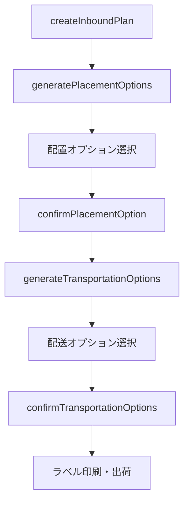

# Fulfillment Inbound API 仕様

本ドキュメントでは、FBA納品プラン作成に使用するFulfillment Inbound APIの仕様を説明する。

---

## 概要

Fulfillment Inbound APIは、AmazonのFBA（Fulfillment by Amazon）フルフィルメントネットワークに在庫を送るための納品プランを作成・管理するAPIである。

---

## APIバージョン

| バージョン | ステータス | 備考 |
|-----------|-----------|------|
| v2024-03-20 | 現行 | 最新バージョン、推奨 |
| v0 | 廃止済み | 2024年12月20日に廃止 |

---

## エンドポイント

| リージョン | エンドポイント |
|-----------|---------------|
| 日本（極東） | https://sellingpartnerapi-fe.amazon.com |

---

## 主要オペレーション（v2024-03-20）

| オペレーション | 用途 |
|--------------|------|
| createInboundPlan | 納品プラン作成 |
| listInboundPlans | 納品プラン一覧取得 |
| getInboundPlan | 納品プラン詳細取得 |
| getShipment | シップメント情報取得 |
| generatePlacementOptions | 配置オプション生成 |
| confirmPlacementOption | 配置オプション確定 |
| generateTransportationOptions | 配送オプション生成 |
| confirmTransportationOptions | 配送オプション確定 |
| confirmDeliveryWindowOptions | 配送時間枠確定 |

---

## 納品プラン作成フロー

---

## createInboundPlan

### リクエスト構造

| フィールド | 型 | 必須 | 説明 |
|-----------|-----|------|------|
| destinationMarketplaces | Array | Yes | 出荷先マーケットプレイスID |
| items | Array | Yes | 出荷商品リスト |
| sourceAddress | Object | Yes | 出荷元住所 |
| name | String | No | プラン名 |

### items配列

| フィールド | 説明 |
|-----------|------|
| msku | マーチャントSKU |
| quantity | 数量 |
| prepOwner | 梱包担当（AMAZON または SELLER） |
| labelOwner | ラベル担当（AMAZON または SELLER） |

### sourceAddress

| フィールド | 説明 |
|-----------|------|
| name | 名前 |
| addressLine1 | 住所1行目 |
| addressLine2 | 住所2行目（オプション） |
| city | 市区町村 |
| stateOrProvinceCode | 都道府県コード |
| postalCode | 郵便番号 |
| countryCode | 国コード（JP） |
| phoneNumber | 電話番号 |

---

## v2024-03-20 の新機能

| 機能 | 説明 |
|------|------|
| SKU上限拡大 | 1プランあたり最大1500 SKU（v0は200 SKU） |
| 複数配置オプション | 複数の納品先オプションから選択可能 |
| Send to Amazonとの互換性 | Seller CentralとAPI間でシップメント編集可能 |

---

## レート制限

| オペレーション | Rate | Burst |
|--------------|------|-------|
| createInboundPlan | 2 requests/second | 6 |
| listInboundPlans | 2 requests/second | 6 |
| その他 | 2 requests/second | 6 |

---

## 梱包カテゴリー（Prep）

| 値 | 説明 |
|-----|------|
| ADULT | 成人向け商品 |
| BABY | ベビー用品 |
| BREAKABLE | 壊れやすい商品 |
| FRAGILE | 割れ物 |
| GRANULAR | 粒状物 |
| HANGER | ハンガー商品 |
| LIQUID | 液体 |
| PERFORATED_PACKAGING | 穴あき包装 |
| SHARP | 鋭利な商品 |
| SMALL | 小型商品 |
| TEXTILE | 繊維製品 |
| SET | セット商品 |

---

## 出荷元住所の設定

本プロジェクトでは、出荷元住所をスクリプトプロパティに設定する。

| プロパティ名 | 説明 |
|-------------|------|
| SHIP_FROM_NAME | 名前 |
| SHIP_FROM_ADDRESS_LINE1 | 住所1行目 |
| SHIP_FROM_ADDRESS_LINE2 | 住所2行目 |
| SHIP_FROM_CITY | 市区町村 |
| SHIP_FROM_STATE | 都道府県コード |
| SHIP_FROM_POSTAL_CODE | 郵便番号 |
| SHIP_FROM_COUNTRY_CODE | 国コード |
| SHIP_FROM_PHONE | 電話番号 |

---

## 本プロジェクトでの実装

### 関連ファイル

| ファイル | 関数 | 役割 |
|---------|------|------|
| spapi_Shipment.js | spapi_createShipmentPlan | 納品プラン作成メイン処理 |
| spapi_Shipment.js | spapi_getSelectedSkus_ | 選択範囲からSKU取得 |
| spapi_Shipment.js | spapi_confirmSkus_ | SKU確認ダイアログ |
| spapi_Shipment.js | spapi_createFbaInboundPlan_ | SP-API呼び出し |
| spapi_Shipment.js | spapi_setPrepDetails_ | 梱包カテゴリー設定 |
| utils_SpApiHelper.js | utils_getSourceAddress | 出荷元住所取得 |

---

## エラーハンドリング

| エラー | 原因 | 対処 |
|--------|------|------|
| INVALID_PREP_OWNER | prepOwnerの値が不正 | AMAZON または SELLER を指定 |
| INVALID_SKU | SKUが存在しない | SKUの登録状況を確認 |
| INVALID_ADDRESS | 住所形式が不正 | 住所の各フィールドを確認 |

---

## 公式リファレンス

- Fulfillment Inbound API v2024-03-20 Use Case Guide: https://developer-docs.amazon.com/sp-api/docs/fulfillment-inbound-api-v2024-03-20-use-case-guide
- Fulfillment Inbound v2024-03-20 Reference: https://developer-docs.amazon.com/sp-api/reference/fulfillment-inbound-v2024-03-20
- Code Samples: https://developer-docs.amazon.com/sp-api/docs/fulfillment-inbound-api-v2024-03-20-code-samples
- Migration Guide: https://developer-docs.amazon.com/sp-api/docs/migrating-fulfillment-inbound-workflows
