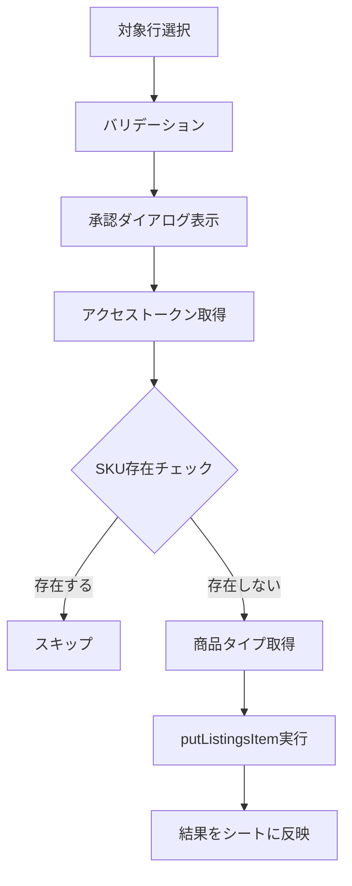

# Listings Items API 仕様

本ドキュメントでは、商品登録に使用するListings Items API v2021-08-01の仕様を説明する。

---

## 概要

Listings Items APIは、Amazonカタログへの商品出品（リスティング）の作成・更新・削除を行うAPIである。

---

## エンドポイント

| リージョン | エンドポイント |
|-----------|---------------|
| 日本（極東） | https://sellingpartnerapi-fe.amazon.com |

---

## 主要オペレーション

| オペレーション | HTTPメソッド | 用途 |
|--------------|-------------|------|
| putListingsItem | PUT | 新規リスティング作成または既存リスティングの完全更新 |
| patchListingsItem | PATCH | 既存リスティングの部分更新 |
| deleteListingsItem | DELETE | リスティングの削除 |
| getListingsItem | GET | リスティング情報の取得 |

---

## putListingsItem（商品登録）

### URL構造

/listings/2021-08-01/items/{sellerId}/{sku}?marketplaceIds={marketplaceId}

### パスパラメータ

| パラメータ | 必須 | 説明 |
|-----------|------|------|
| sellerId | Yes | セラーID |
| sku | Yes | 商品のSKU（URL エンコード必須） |

### クエリパラメータ

| パラメータ | 必須 | 説明 |
|-----------|------|------|
| marketplaceIds | Yes | マーケットプレイスIDのカンマ区切りリスト |

---

## リクエストボディ

### 基本構造

| フィールド | 型 | 必須 | 説明 |
|-----------|-----|------|------|
| productType | String | Yes | Amazon商品タイプ |
| requirements | String | No | LISTING または LISTING_OFFER_ONLY |
| attributes | Object | Yes | 商品属性オブジェクト |

### requirements オプション

| 値 | 説明 |
|-----|------|
| LISTING | 完全なリスティング情報を含める |
| LISTING_OFFER_ONLY | オファー情報のみ（既存カタログ商品への相乗り） |

---

## 属性（attributes）の構造

### 必須属性

| 属性名 | 説明 |
|--------|------|
| condition_type | 商品のコンディション |
| purchasable_offer | 価格情報 |
| fulfillment_availability | フルフィルメント方式 |
| merchant_suggested_asin | 相乗り対象のASIN |

### condition_type

| 値 | 説明 |
|-----|------|
| new_new | 新品 |
| new_open_box | 新品（開封済み） |
| new_oem | 新品（OEM） |
| refurbished_refurbished | 再生品 |
| used_like_new | 中古 - ほぼ新品 |
| used_very_good | 中古 - 非常に良い |
| used_good | 中古 - 良い |
| used_acceptable | 中古 - 可 |

### purchasable_offer

価格情報を指定する。

- marketplace_id: マーケットプレイスID
- currency: 通貨コード（日本: JPY）
- our_price: 販売価格（schedule配列内にvalue_with_taxを指定）

### fulfillment_availability

| fulfillment_channel_code | 説明 |
|--------------------------|------|
| AMAZON_JP | FBA（Amazonが発送） |
| DEFAULT | 出品者発送（MFN） |

---

## 追加属性（オプション）

| 属性名 | 説明 |
|--------|------|
| batteries_required | バッテリー必要有無 |
| supplier_declared_dg_hz_regulation | 危険物規制情報 |

### supplier_declared_dg_hz_regulation の値

| 値 | 説明 |
|-----|------|
| not_applicable | 該当なし |
| storage | 保管のみ |
| transportation | 輸送 |
| unknown | 不明 |

---

## レート制限

| 項目 | 値 |
|------|-----|
| Rate | 5 requests/second |
| Burst | 10 requests |

---

## レスポンス

### 成功時（HTTP 200）

| フィールド | 説明 |
|-----------|------|
| sku | 登録されたSKU |
| status | 処理ステータス（ACCEPTED等） |
| submissionId | 送信ID |
| issues | 処理時の問題（警告含む） |

### エラー時（HTTP 4xx/5xx）

| フィールド | 説明 |
|-----------|------|
| errors | エラー配列 |
| errors[].code | エラーコード |
| errors[].message | エラーメッセージ |
| errors[].details | 詳細情報 |

---

## 主なエラーコード

| エラーコード | 説明 |
|-------------|------|
| INVALID_ATTRIBUTE_VALUE | 属性値が不正 |
| MISSING_REQUIRED_ATTRIBUTE | 必須属性が不足 |
| INVALID_PRODUCT_TYPE | 商品タイプが不正 |
| DUPLICATE_SKU | SKUが重複 |
| INVALID_ASIN | ASINが無効 |

---

## 本プロジェクトでの実装

### 関連ファイル

| ファイル | 関数 | 役割 |
|---------|------|------|
| spapi_registerProducts.js | spapi_putListing | 商品登録リクエスト送信 |
| spapi_registerProducts.js | spapi_checkSkuExists | SKU存在確認 |
| spapi_registerProducts.js | spapi_executeRegistration | 登録処理実行 |

### 処理フロー

---

## 公式リファレンス

- Listings Items API: https://developer-docs.amazon.com/sp-api/docs/listings-items-api
- putListingsItem: https://developer-docs.amazon.com/sp-api/reference/putlistingsitem
- Listings Items v2021-08-01: https://developer-docs.amazon.com/sp-api/reference/listings-items-v2021-08-01
- トラブルシューティング: https://developer-docs.amazon.com/sp-api/docs/listings-items-api-issues-troubleshooting
