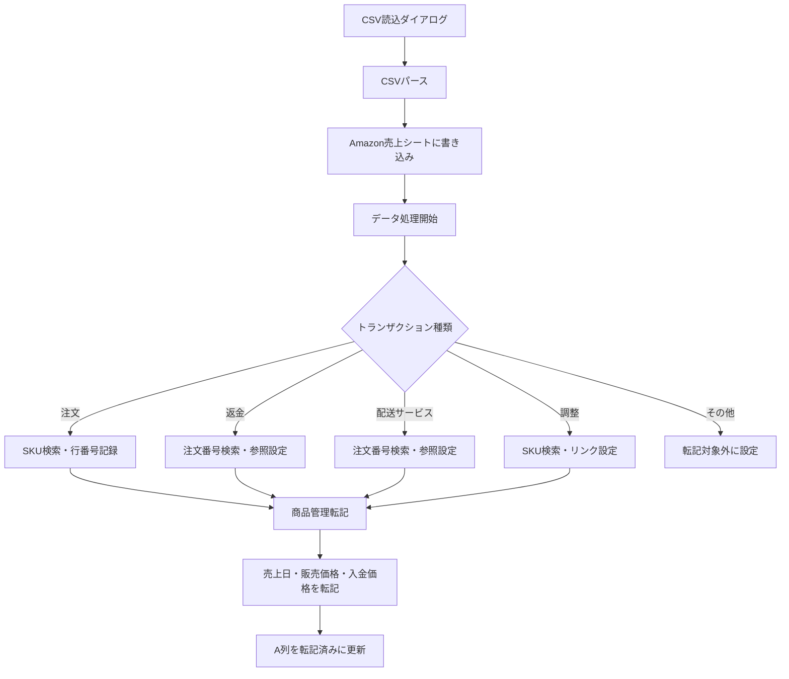
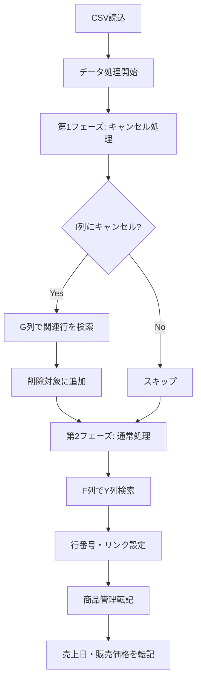

# srcモジュール一覧

本ドキュメントでは、srcディレクトリ配下の各モジュールと関数の役割を説明する。

---

## ディレクトリ構成

| ディレクトリ | 役割 |
|-------------|------|
| amazon | Amazon売上データ処理・転記・レポート出力 |
| mercari | メルカリ売上データ処理・転記 |
| sp-api | Amazon SP-API連携（商品登録・納品プラン） |
| core | 共通設定・メニュー初期化 |
| utils | 共通ユーティリティ関数 |
| tools | 補助ツール（商品管理コピー等） |

---

## amazon ディレクトリ

Amazon売上データの処理を担当するモジュール群。

### amazon_UI.js

UIとボタンハンドラーを提供するモジュール。

| 関数名 | 役割 |
|--------|------|
| amazon_handleCsvImport | ボタン1: CSVファイル読込ダイアログを表示 |
| amazon_handleDataProcessing | ボタン2: データ処理を実行 |
| amazon_handleTransfer | ボタン3: 商品管理シートへの転記を実行 |
| amazon_processCsvContent | ダイアログから呼び出されるCSVコンテンツ処理 |
| amazon_parseCsvContent | CSVテキストをパースしてデータ配列に変換 |
| amazon_parseCSVLine | CSV1行をフィールド配列に分解 |
| amazon_writeToSalesSheet | パースしたデータをAmazon売上シートに書き込み |
| amazon_getExistingData | 既存データを取得（重複チェック用） |
| amazon_filterDuplicates | 重複データを除外 |
| amazon_arraysEqual | 2つの配列が等しいか判定 |

### amazon_DataProcessing.js

売上データの処理とSKU検索を担当するモジュール。

| 関数名 | 役割 |
|--------|------|
| amazon_processData | メイン処理: A列空白行からデータ処理を開始 |
| amazon_processRows | 複数行のデータ処理をループ実行 |
| amazon_processDataRow | 1行のデータをトランザクション種類別に処理分岐 |
| amazon_processAdjustment | 調整トランザクションの処理（SKU検索・リンク設定） |
| amazon_processRefund | 返金トランザクションの処理（注文番号検索） |
| amazon_processSKUSearchWithQuantity | 注文トランザクションの処理（数量分のSKU検索） |
| amazon_processDeliveryService | 配送サービストランザクションの処理 |
| amazon_searchSKU | 商品管理シートでSKUを検索（シートから直接検索） |
| amazon_getProductStatus | 商品ステータスを計算（Z/AA/AF列から判定） |
| amazon_getColumnByHeader | ヘッダー名から列番号を取得 |
| amazon_batchUpdateSheet | A/B/C/D列の更新を一括実行 |
| amazon_searchSKUInArray | 配列データからSKUを検索（高速版） |
| amazon_searchOrderNumberInData | 配列データから注文番号を検索 |

### amazon_ProductTransfer.js

Amazon売上データを商品管理シートに転記するモジュール。

| 関数名 | 役割 |
|--------|------|
| amazon_parseDateOnly | 日付文字列をDateオブジェクトに変換（時刻除去） |
| amazon_transferToProductSheet | メイン処理: 商品管理シートへの転記を実行 |
| amazon_processTransferRows | 転記対象行をループ処理 |
| amazon_transferSalesData | 注文データの転記（売上日・販売価格・入金価格） |
| amazon_processRefundData | 返金データの処理（売上データクリア） |
| amazon_processShippingService | 配送サービスデータの転記（AE列） |
| amazon_processAdjustmentData | 調整データの転記 |

### amazon_SalesReport.js

SP-API Finances APIを使用した販売詳細レポート出力モジュール。

| 関数名 | 役割 |
|--------|------|
| amazon_showMonthSelectionDialog | 月選択ダイアログを表示 |
| amazon_getDialogHtml | ダイアログのHTMLを生成 |
| amazon_generateReport | レポート生成のメイン処理 |
| amazon_getDateRange | 対象月の開始日・終了日を計算 |
| amazon_getAccessToken | LWAアクセストークンを取得 |
| amazon_fetchFinancialEvents | Finances APIからイベントを取得（ページネーション対応） |
| amazon_collectShipmentEvents | 出荷イベントを収集 |
| amazon_collectRefundEvents | 返金イベントを収集 |
| amazon_collectServiceFeeEvents | サービス料金イベントを収集 |
| amazon_collectAdjustmentEvents | 調整イベントを収集 |
| amazon_createEventRow | イベント行データを作成 |
| amazon_sumChargesByType | 請求タイプ別に金額を集計 |
| amazon_sumFeesByType | 手数料タイプ別に金額を集計 |
| amazon_sumPromotions | プロモーション金額を集計 |
| amazon_sumFeeList | 手数料リストの合計を計算 |
| amazon_getAmountValue | 金額オブジェクトから数値を取得 |
| amazon_detectFulfillment | FBA/MFNを判定 |
| amazon_formatDate | 日付をフォーマット |
| amazon_convertToCsvRows | イベントデータをCSV行に変換 |
| amazon_formatNumber | 数値をフォーマット |
| amazon_saveToGoogleDrive | CSVファイルをGoogleドライブに保存 |
| amazon_getUniqueFileName | 重複しないファイル名を生成 |
| amazon_escapeCsvCell | CSVセルをエスケープ |

### amazon_CsvDialog.html

Amazon CSV読込用のHTMLダイアログ。ファイル選択とアップロード機能を提供する。

---

## mercari ディレクトリ

メルカリ売上データの処理を担当するモジュール群。

### mercari_UI.js

メルカリ用のUIとボタンハンドラーを提供するモジュール。Amazon版と同様の構成。

### mercari_DataProcessing.js

メルカリ売上データの処理を担当するモジュール。

| 関数名 | 役割 |
|--------|------|
| mercari_processData | メイン処理: A列空白行からデータ処理を開始 |
| mercari_processRows | 2段階処理: キャンセル処理→通常検索処理 |
| mercari_processNormalDataRow | 通常行のデータ処理（F列でY列検索） |
| mercari_processDataRow | 1行のデータ処理（キャンセル判定含む） |
| mercari_batchUpdateSheet | A/B/C/D列の更新を一括実行 |
| mercari_collectRowsToDelete | G列値で関連行を削除対象に追加 |
| mercari_deleteRow | 行を削除 |
| mercari_searchProductByYColumn | 商品管理シートのY列から商品を検索 |

#### メルカリ固有の処理

- キャンセル処理: I列に「キャンセル」を含む場合、G列値で関連行を検索し削除
- 数量処理: O列から数量を抽出（例: 「3個」→3）

### mercari_ProductTransfer.js

メルカリ売上データを商品管理シートに転記するモジュール。

### mercari_CsvDialog.html

メルカリ CSV読込用のHTMLダイアログ。

---

## sp-api ディレクトリ

Amazon SP-API連携を担当するモジュール群。

### spapi_registerProducts.js

SP-APIを使用した商品登録モジュール。

| 関数名 | 役割 |
|--------|------|
| spapi_getScriptConfig | スクリプトプロパティから設定を取得 |
| spapi_registerSelectedProducts | メイン処理: 選択行の商品を登録 |
| spapi_getTargetRowsFromSelection | 選択範囲から対象行番号を抽出 |
| spapi_getRowDataList | 対象行のデータを取得 |
| spapi_analyzeTargetRows | 重複チェック・スキップ対象を分析 |
| spapi_groupByDuplicateValue | X列値でグループ化 |
| spapi_hasSkipValue | Y列にスキップ対象値があるか判定 |
| spapi_validateRowData | 行データのバリデーション |
| spapi_showApprovalDialog | 登録前の確認ダイアログを表示 |
| spapi_executeRegistration | 登録処理を実行 |
| spapi_getAccessToken | アクセストークンを取得 |
| spapi_checkSkuExists | SKUの存在チェック |
| spapi_putListing | 商品登録（PUT） |
| spapi_getProductTypeByAsin | ASINから商品タイプを取得 |
| spapi_detectErrorType | エラータイプを検出 |
| spapi_showResult | 結果ダイアログを表示 |
| spapi_showResultDialog | 詳細結果ダイアログを表示 |
| spapi_updateResultCell | 結果セルを更新 |
| spapi_copySkuToColumn | SKUを指定列にコピー |
| spapi_copyValueToSkipColumn | Y列にX列の値をコピー |
| spapi_copyValueToDuplicateRows | 重複行のY列にもコピー |

### spapi_Shipment.js

FBA納品プラン作成モジュール。

| 関数名 | 役割 |
|--------|------|
| spapi_createShipmentPlan | メイン処理: FBA納品プランを作成 |
| spapi_getSelectedSkus_ | 選択範囲からSKUを取得・集計（飛び飛び選択対応、フィルター非表示行除外） |
| spapi_confirmSkus_ | SKU一覧を表示し確認を求める |
| spapi_getAccessToken_ | アクセストークンを取得 |
| spapi_getSourceAddress_ | 出荷元住所を取得 |
| spapi_createFbaInboundPlan_ | SP-APIで納品プランを作成 |
| spapi_setPrepDetails_ | SKUの梱包カテゴリーを設定 |
| spapi_buildItemsArray_ | items配列を構築 |
| spapi_handlePrepOwnerError_ | prepOwnerエラー時のリトライ処理 |
| spapi_showResult_ | 結果を表示しセラーセントラルを開く |
| spapi_openUrlInNewTab_ | URLを新しいタブで開くダイアログ |
| spapi_checkScriptProperties | スクリプトプロパティの設定状況を確認 |
| spapi_testSpApiConnection | SP-API接続テスト |

---

## core ディレクトリ

共通設定とメニュー初期化を担当するモジュール群。

### core_config.js

スプレッドシートの列構成などの設定定数を定義。

| 定数名 | 役割 |
|--------|------|
| PROFIT_SHEET_CONFIG | 利益確認シートの列番号設定 |

### core_onOpen.js

スプレッドシート起動時の初期化処理。

| 関数名 | 役割 |
|--------|------|
| onOpen | メニューを初期化（カスタムメニュー追加） |

---

## utils ディレクトリ

共通ユーティリティ関数を提供するモジュール群。

### utils_SpApiHelper.js

SP-API呼び出しの共通ヘルパー関数。

| 関数名 | 役割 |
|--------|------|
| utils_getSpApiAccessToken | アクセストークンを取得 |
| utils_getSpApiConfig | SP-API設定を取得 |
| utils_makeSpApiRequest | SP-APIリクエストを実行 |
| utils_makeSpApiRequestWithRetry | リトライ付きでSP-APIリクエストを実行 |
| utils_handleSpApiError | SP-APIエラーを処理 |
| utils_getSourceAddress | 出荷元住所を取得 |
| utils_buildSpApiUrl | SP-API URLを構築 |

### utils_CommonUtils.js

汎用ユーティリティ関数。

### utils_ProductSearchHelper.js

商品検索ヘルパー関数。

---

## tools ディレクトリ

補助ツールを提供するモジュール群。

### tools_CopyToProductManagement.js

利益確認シートから商品管理シートへのデータコピーツール。

| 関数名 | 役割 |
|--------|------|
| tools_copyCheckedRowsToProductManagement | メイン処理: チェック行をコピー |
| tools_validateQuantity | 個数のバリデーション |
| tools_getLastRowWithData | シートの最終行を取得 |
| tools_onOpen | カスタムメニューを追加 |
| tools_showUsage | 使い方を表示 |
| tools_debugSheetInfo | デバッグ用シート情報出力 |

#### 処理概要

- A列のチェックボックスがONの行を対象
- B列の個数分だけ商品管理シートにデータをコピー
- コピー対象列: C列～O列、Y列
- コピー後、元データは削除される

---

## 命名規則

各モジュールは以下の命名規則に従う。

| プレフィックス | 対象ディレクトリ |
|---------------|-----------------|
| amazon_ | amazon |
| mercari_ | mercari |
| spapi_ | sp-api |
| core_ | core |
| utils_ | utils |
| tools_ | tools |

---

## 処理フロー

### Amazon売上処理フロー

### メルカリ売上処理フロー

---

## 関連ドキュメント

| ドキュメント | 内容 |
|-------------|------|
| overview.md | システム概要 |
| sales-processing.md | 売上処理詳細 |
| sp-api.md | SP-API連携詳細 |
| fba-management.md | FBA管理機能詳細 |
| utilities.md | ユーティリティ詳細 |
