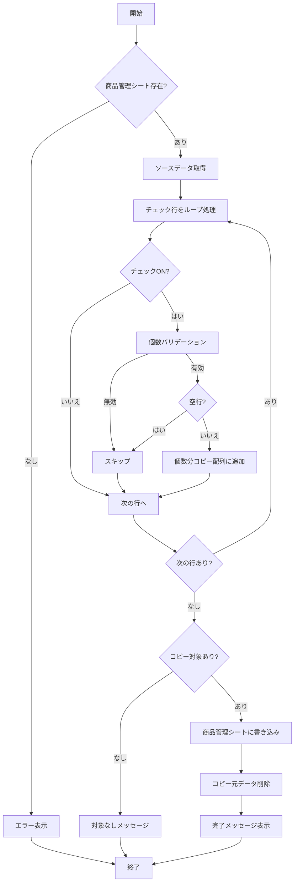

# ユーティリティ機能

商品管理の補助機能。

## 対応ファイル

| ファイル名 | 役割 |
|-----------|------|
| CopyToProductManagement.js | 利益確認シート→商品管理シートコピー |

---

## 商品管理シートへのコピー

### 概要

利益確認シートでチェックボックスがONの行を、指定個数分だけ商品管理シートにコピーする。

### 処理フロー

### メイン関数

**関数**: copyCheckedRowsToProductManagement

**処理内容**:
1. 「商品管理」シートの存在確認
2. ソースシートからデータ取得（A列チェックボックス、B列個数、C～O列データ、Y列データ）
3. チェックONの行をループ処理
4. 個数バリデーション・空行チェック
5. 個数分のデータを配列に格納
6. 商品管理シートに一括書き込み
7. コピー元のデータを削除
8. 完了メッセージを表示

### シート構成

**ソースシート（利益確認シート）**:

| 行 | 内容 |
|---|------|
| 1行目 | 任意 |
| 2行目 | ヘッダー |
| 3行目以降 | データ行 |

**ソースシート列構成**:

| 列 | 用途 |
|---|------|
| A | チェックボックス |
| B | 個数 |
| C～O | コピー対象データ（13列） |
| Y | コピー対象データ（SKU） |

### 個数バリデーション

**関数**: validateQuantity

**チェック項目**:

| チェック内容 | 結果 |
|------------|------|
| 空・null・undefined | スキップ |
| 数値以外 | スキップ |
| 0以下 | スキップ |
| 1000超過 | スキップ |
| 1～1000の整数 | 有効 |

### コピー処理

**コピー先の決定**:
- 商品管理シートのC列を基準に最終行を検出
- 最終行の次の行から挿入開始

**コピー対象**:
- C列～O列（13列分）
- Y列（1列分）

**コピー後の処理**:
- ソースシートの該当行のC列～O列、Y列をクリア
- チェックボックス（A列）・個数（B列）は保持

### メニュー

| メニュー項目 | 実行関数 | 機能 |
|-------------|---------|------|
| チェック行をコピー | copyCheckedRowsToProductManagement | メイン処理実行 |
| 使い方を表示 | showUsage | 操作説明ダイアログ表示 |

---

## デバッグ機能

### シート情報確認

**関数**: debugSheetInfo

**出力内容**:
- スプレッドシート名
- アクティブシート名
- 最終行・最終列
- 商品管理シートの存在確認
- ヘッダー行とデータ行のプレビュー

---

## エラーハンドリング

| 状況 | 処理 |
|-----|------|
| 商品管理シート未存在 | エラーメッセージを表示して処理中断 |
| データ行なし | メッセージを表示して処理中断 |
| チェック行なし | メッセージを表示して処理中断 |
| 個数が無効 | その行をスキップ |
| 空行 | その行をスキップ |
| 書き込みエラー | エラーメッセージを表示 |
